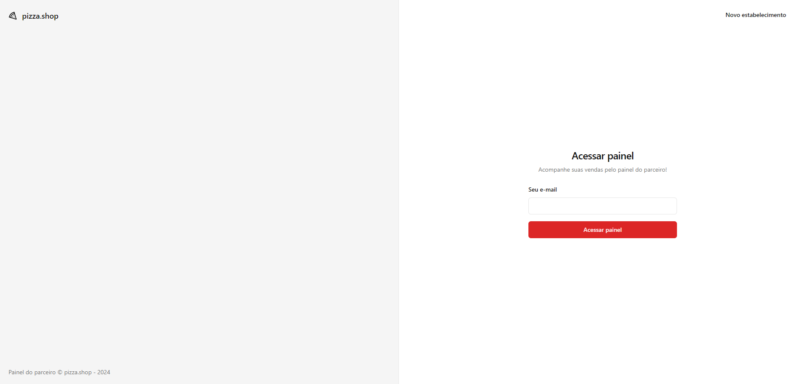
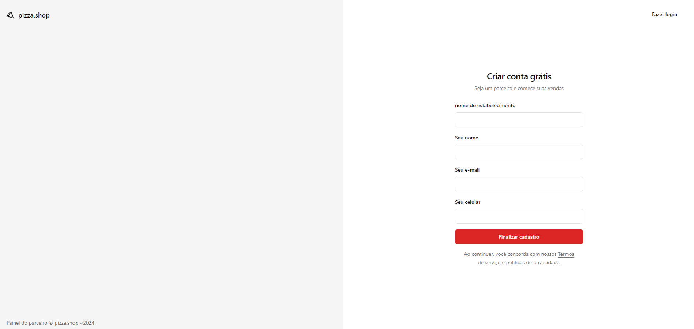
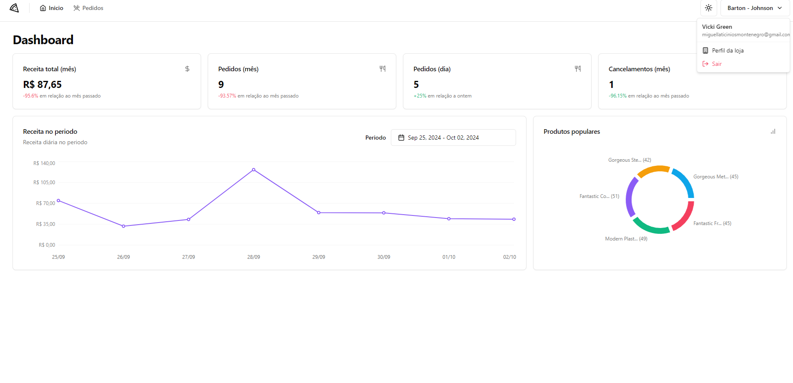
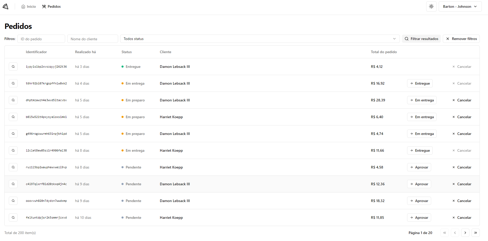
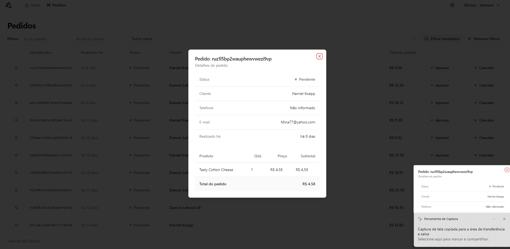

# pizza.shop

pizza.shop: shadcn/ui,eslint,tailwind,prettier,plugin simple-import-sort,
react-router-dom,sonner,recharts,bun,axios,docker,zod,react-query,date-fns
dar o bun dev no terminal do pizzashop-web-api,vitest(testes unitarios),testing library(testes react)=testar componentes na DOM,jest-DOM(auxilia nos testes unitarios,APIs para trabalhar direto com elementos HTML),happy-dom(simula um navegador para os testes),msw(mock de api back-end),PlayWright(teste end-to-end): pnpm playwright test --ui.

Here’s the translation to English:

pizza.shop:

shadcn/ui,
ESLint,
Tailwind,
Prettier,
Simple Import Sort Plugin,
React Router DOM,
Sonner,
Recharts,
Bun,
Axios,
Docker,
Zod,
React Query,
Date-fns.
Vitest (unit testing),
Testing Library (testing React components in the DOM),
jest-DOM (assists in unit tests, APIs for working directly with HTML elements),
Happy DOM (simulates a browser for tests),
MSW (mocks a back-end API),
Playwright (end-to-end testing): pnpm playwright test --ui.

